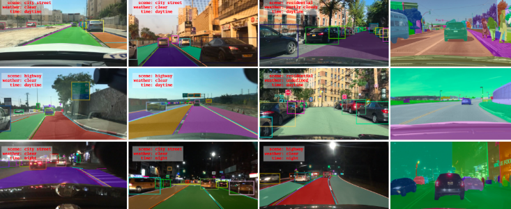
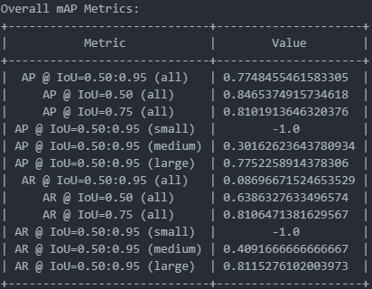
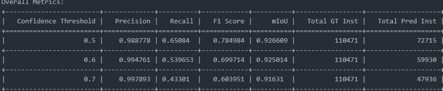

# BDD Object Detectors

This repository contains various object detectors designed for the BDD (Berkeley DeepDrive) object detection task. The following sections provide a comprehensive guide on how to utilize these detectors, including exploratory data analysis (EDA), training, inference, evaluation, and deployment details.


## Introduction

Object detection is a crucial aspect of autonomous driving, where the goal is to accurately identify and locate various objects in driving scenes. This repository focuses on providing efficient and effective models for the BDD object detection task, leveraging state-of-the-art techniques to ensure high performance in real-world scenarios.

```
├── data                  # keep BDD data 
├── data_processing       # For EDA and data creation
│   ├── EDA                
│   └── data_creation
├── deployment            # deployment app
│   └── app.py
├── evaluation            # Evaluation notebook for Analysis
│   ├── Evaluate.ipynb
│   └── core_assist
├── notebooks             # Extra notebooks
├── training              # Training Scripts
│   └── YOLOP
```
## 1. Data

Folder to keep all your BDD100K object detectio dataset and EDA and analysis files.
You can get more details about dataset from [here](https://bair.berkeley.edu/blog/2018/05/30/bdd/)


### 1.1 Download dataset
You can download dataset from [here](https://bair.berkeley.edu/blog/2018/05/30/bdd/).  


Data folder should look like.

```
data
├── bdd100k_images_100k
│   └── bdd100k
│       └── images
│           └── 100k
│               ├── test
│               ├── train
│               ├── val
│          
├── bdd100k_labels_release
│   └── bdd100k
│       └── labels
│           ├── bdd100k_labels_images_train.json
│           ├── bdd100k_labels_images_val.json
```


## 2. Exploratory Data Analysis (EDA)

Before diving into training, it's essential to perform exploratory data analysis to understand the dataset's characteristics:

- **Dataset Overview**: The BDD dataset contains diverse driving scenes with various annotations, including object detection, drivable area segmentation, and lane detection. In our use_case we will only focus on Object detection task which mainly consists of 'truck', 'train', 'person', 'bus', 'car', 'rider', 'traffic sign', 'bike', 'traffic light', 'motor'.

### Steps to run EDA
> Required files are zipped in data folder. Please unzip it : unzip ./data/val.zip ./data/

You can check EDA at [./data_processing/EDA/EDA.ipynb](./data_processing/EDA/EDA.ipynb).  

Otherwise, you can follow below steps to crete EDA from scratch.  

#### 2.1 Process Annotations to extract image and annotation features into csv file.  
2.1.1 You need to run docker container to perform EDA. To create container follow below steps.  

- **For Windows** :  
    Open powershell and run below command  
    > ./eda.ps1  

- **For Linux**:  
    Open terminal and run below command  
    > make Run_EDA_Docker  

2.1.2 Run command to extract information from BDD100k annotation files.
> ./process.sh process_eda_data

This will save 2 csv files each for train and val split at data folder. 
1. images_features.csv (contains image features)
2. object_detection_annotations.csv (contains annotation features).  

Both of these files are used by EDA notebook. 

#### 2.2 Access EDA jupyter notebook
- Run command in container terminal
> jupyter notebook EDA.ipynb --ip=0.0.0.0 --port=8000 --no-browser --allow-root --NotebookApp.token='' --NotebookApp.password='' 

- Access EDA notebook by pasting below url in browser
> http://127.0.0.1:8000/notebooks/EDA.ipynb


## 3. Training
In this experiment, We have used YoloP (https://github.com/hustvl/YOLOP) model, as it is
1. Trained model is available.
2. Multi-task capability in model with promising results.
3. Training scipts are well maintained. 

> Note : I have tried 2 other models : AYoloM (https://github.com/jiayuanwang-jw/yolov8-multi-task) and BDD_models (https://github.com/SysCV/bdd100k-models) but both are have issues related either pretrained model availability or loading issues and library installation issues. Hence for experimentation i have opted for simple model.

To train the object detectors, follow these steps:
### 3.1. Create Yolo dataset
Use script [data_processing\data_creation\bdd_to_yolo.py](data_processing\data_creation\bdd_to_yolo.py) to create yolo data from BDD annotations.
```python
python bdd_to_yolo.py \
    --bdd_json_path ./data/bdd100k_labels_release/bdd100k/labels/bdd100k_labels_images_train.json \
    --output_dir ./data/yolo \
    --class_map ./data_processing/data_creation/yolo_class_map.txt
```

### 3.2 Training
Current model is trained on only one class, having below features
1. Ignored Pedastrians, Traffic light and symbols.
2. Combined 'car','bus', 'truck','rider', 'bike', 'motor', 'train' into one class.

For modified training, please follow steps mentioned [here](./training/YOLOP)

## 4. Evaluation

To evaluate the model's performance on the validation dataset we have written our custom script to get **mAP, Precision, Recall and F1 score**. This custom evaluation helps in filtering failure cases for better analysis.

For evaluation we have performed the inference using command
>Note: Install libraries : pip install -r ./training/YOLOP/requirements.txt
```python
python ./training/YOLOP/test_onnx_det.py \
    --weight ./training/YOLOP/weights/yolop-640-640.onnx \
    --img_dir ./inference/images/ \
    --json_output_dir ./data/object_detection/bdd_val_infer
```
This save json files for each image which contains information directly used by evaluation scripts mentioned in evaluate notebook.

Please check Evaluation notebook [evaluation/Evaluate.ipynb](evaluation/Evaluate.ipynb)

#### 4.1 mAP metric


#### 4.2 Other stats
Stats based on different confidence thresholds


>Note: For better analysis please check the notebook

#### 4.3 Analysis
1. There is impact of Bluriness on model predictions
2. There is impact of low light Night images.
3. There is slight impact of occlusion on predcitions.
4. There is impact of small annotations.

## Inference
>Note: Install libraries : pip install -r ./training/YOLOP/requirements.txt
```python
python ./training/YOLOP/test_onnx_det.py \
    --weight ./training/YOLOP/weights/yolop-640-640.onnx \
    --img_dir ./inference/images/ \
    --json_output_dir ./data/inference/onnx_det/
```

## 5. Deployment

We have converted pytorch model to onnx.   
>Note: Install libraries : pip install -r ./deployment/requirements.txt

5.1. Run fastapi
```bash
python ./deployment/app.py
```

5.2 Hit endpoint
```bash
curl -X POST http://127.0.0.1:8000/predict/ \
  -F "file=@path_to_your_image.jpg"
```


## 6. Future Improvements
1. Train model as multi-class problem for better handling of different classes.
2. Include more augmentations related to blur and noise.
3. Try better architecture, as Yolo generally does not performs well on small and occluded objects.
4. Clean subjective annotations